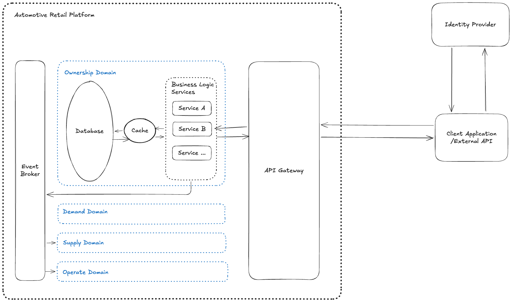

SYSTEM: Automotive Retail Platform (ARP)

# 1. Architecture diagram

# 2. Architecture styles and patterns

Here are software architectures and patterns implemented across this Automotive Retail Platform (ARP)

## Domain-Driven Design

The business is broken down into autonomous Bounded Contexts (Demand, Supply, Ownership, and Operate) , which completely isolate code dependencies and optimize business logic boundaries.

## Distributed Polyglot Architecture

Instead of deploying a single monolithic database , the platform adopts a polyglot storage engine where each microservice uses a specialized database type optimized for its exact workload

## Event-Driven Architecture (EDA):

A system style built entirely around an asynchronous event backend (like Publish-Subscribe Pattern implemented via the Event Broker). Domains do not call each other through direct, tightly coupled connections; instead, they operate as a distributed mesh communicating exclusively through events.

## API Gateway / Facade Architecture

A structural layer (often utilizing GraphQL or RESTful Open APIs) that aggregates data from disparate backend microservices. It presents a single, unified data abstraction to external third-party tools and manufacturer (OEM) platforms.

# 2. Components

| Category       | Components                        | Role                                                                                                                                    | Note                                                                                                                                                                                                                                                                                                                          |
| -------------- | --------------------------------- | --------------------------------------------------------------------------------------------------------------------------------------- | ----------------------------------------------------------------------------------------------------------------------------------------------------------------------------------------------------------------------------------------------------------------------------------------------------------------------------- |
| External       | Client Application/External tools | ...                                                                                                                                     |                                                                                                                                                                                                                                                                                                                               |
| IdP            | Identity Provider                 | Central Identity Service that authenticates users' identities and authorizes their access to the System                                 | Once a user is successfully authenticated by the central Identity Provider, the platform switches to a Stateless Token-Based Pattern to handle subsequent API traffic across internal microservices.                                                                                                                          |
| System         | API Gateway                       | API Gateway acts as a centralized reverse proxy that serves as the single entry point for all external client requests into the System. | It shields internal architecture, centralizes security validation and handles route traffic.                                                                                                                                                                                                                                  |
| System         | Event Broker                      | It helps services in System communicate asynchronously using Publish/Subscribe model.                                                   | Future usecase: After an appointment is created sucessfull, we may need to notify services that care about this event so that they can do their relevant job. (ex: Sendmail Service,...)                                                                                                                                      |
| System->Domain | Business Logic Services           | Handle business logic.                                                                                                                  | Create New                                                                                                                                                                                                                                                                                                                    |
| System->Domain | Database                          | Contains data that each Domain cares about.                                                                                             | Assume that all data entities that new feature cares are already exist. Please refer to Appendix for DB schema detail.                                                                                                                                                                                                     |
| System->Domain | Cache                             | ...                                                                                                                                     | This is designed for future use case: when user select a date, system will return all available time slot in that specific date. Use cache to improve performance: by caching the calculated result from first time that date selected, and revalidate each time there is an appointment created sucessfully for that date |
