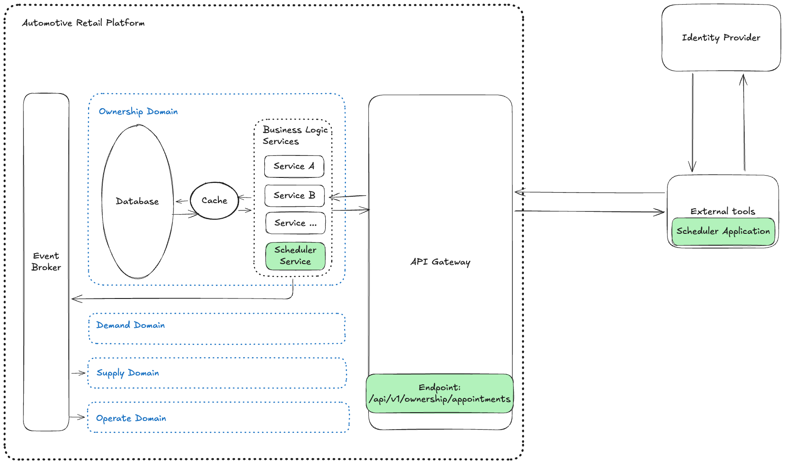

# Design Document for [Appointment Scheduler Application to replace manual booking]

## 1. Overview

This is a new feature that belongs to the Ownership domain of an existing Automotive Retail Platform (ARP).
Core requirements:

- User can request a service appointment for a specific vehicle, service type, and dealership at a desired time.
- When system receives the request, it will:
  - Check for the availability of both a Service Bay and a qualified Technician for the entire service duration.
  - Upon success, create a persistent Appointment record associating the customer, vehicle, technician, and service bay.

---

## 2. Assumptions

| Assumption                         | Note                                                                                                                                                                                                                                                                                                                                                                                                                                                                                                                                                                                                                                                                                                                                                                                                                                                          |
| ---------------------------------- | ------------------------------------------------------------------------------------------------------------------------------------------------------------------------------------------------------------------------------------------------------------------------------------------------------------------------------------------------------------------------------------------------------------------------------------------------------------------------------------------------------------------------------------------------------------------------------------------------------------------------------------------------------------------------------------------------------------------------------------------------------------------------------------------------------------------------------------------------------------- |
| **Target User**                    | The user is the end customer booking their own appointment.                                                                                                                                                                                                                                                                                                                                                                                                                                                                                                                                                                                                                                                                                                                                                                                                   |
| **Concepts**                       | 1. **Business hours**: 09:00 to 12:00 and 13:00 to 18:00 (1-hour lunch break: 12:00 ~ 13:00) 2. **Time slot concept**: A typical day divided into 15-minute segments: &nbsp;&nbsp;&nbsp;&nbsp;- Slot 1: 09:00 - 09:15 &nbsp;&nbsp;&nbsp;&nbsp;- Slot 2: 09:15 - 09:30 &nbsp;&nbsp;&nbsp;&nbsp;- Slot 3: 09:30 - 09:45 &nbsp;&nbsp;&nbsp;&nbsp;- and so on... Applying the working hours to a 15-minute slot system yields a total of **32 slots** for a single workday.                                                                                                                                                                                                                                                                                                                                                                     |
| **User Inputs Required**           | When requesting an appointment, the user needs to input the following fields: • **[Vehicle]**: Select one vehicle from the user's vehicle list. • **[Dealership]**: Select one dealership from the dealership list. • **[Service Type]**: Select one service from the service list. • **[Start Date]**: Select a date within 30 days from today. • **[Start Time]**: Select a time point (each time point is the start time of a time slot).  _Note: The user does not input an end time, as it is automatically calculated based on the start time and the service's duration (stored in the database)._                                                                                                                                                                                                                                |
| **Appointment Time Constraints**   | • Start time must be within business hours. • Start time must be greater than 15 minutes from the current time. • The complete `[Start Time ~ End Time]` range must fall within business hours (lunch break will not be counted).  _Note: precise rules (15-min slot alignment, 30-day booking window, lunch-break end-time extension logic) are fully specified in the Scheduler Service detail design, Section 3.2._                                                                                                                                                                                                                                                                                                                                                                                                                            |
| **Service Bay Availability Check** | Ensure at least one service bay has no conflicting appointments during the appointment time range.                                                                                                                                                                                                                                                                                                                                                                                                                                                                                                                                                                                                                                                                                                                                                            |
| **Technician Availability Check**  | Ensure at least one qualified technician has no conflicting appointments during the appointment time range.  _Note: A qualified technician is defined as having a skill level greater than or equal to (>=) the required service skill level._                                                                                                                                                                                                                                                                                                                                                                                                                                                                                                                                                                                                          |
| **Out of Scope**                   | Due to requirement ambiguity and time scope, the following points are out-of-scope: • Service advisor booking on customer's behalf. • Holiday and weekend calendar logic. • Per-dealership variations for business hours/lunch breaks (assumed to be a single global schedule). • Real-world business combination rules between vehicle/dealership/service type. • Multi-resource services (each appointment assumes exactly 1 generic service bay and 1 technician). • Disabling/preventing users from selecting time durations where resources are unavailable (future use case). • Compatibility logic linking specific service bays to specific service types or vehicle models. • Complex technician shift patterns, rotations, or individual break schedules (technicians are assumed available all day unless already booked). |

---

## 3. Architecture

Assume that current system's architecture is as describe in [Architecture.md](Architecture.md)

This new feature will fit into current system as following

### Components that affect this new feature.

| Category                  | Components            | Scope           | Detail                                                                                                                                                                                                                                                                                                   |
| ------------------------- | --------------------- | --------------- | -------------------------------------------------------------------------------------------------------------------------------------------------------------------------------------------------------------------------------------------------------------------------------------------------------- |
| External                  | Scheduler Application | Add             | User facing application. After logged in to the application, user can request a workshop appointment for a specific vehicle.                                                                                                                                                                             |
| System                    | API Gateway           | Update          | Add new API endpoint for the new feature. Detail design: [DD_API_Gateway_Appointments.md](detail_design/DD_API_Gateway_Appointments.md)                                                                                                                                                                  |
| System                    | Event Broker          | Future consider | Future usecase: After an appointment is created sucessfull, we may need to notify services that care about this event so that they can do their relevant job. (ex: Sendmail Service,...)                                                                                                                 |
| System->Domain: Ownership | Scheduler Service     | Add             | Business Logic Service for the new feature. Detail design: [DD_Scheduler_Service_CreateAppointment.md](detail_design/DD_Scheduler_Service_CreateAppointment.md)                                                                                                                                          |
| System->Domain: Ownership | Database              | Not change      | Assume that all data entities that new feature cares are already exist. Database schema is designed here: [DatabaseSchema.png](images/DatabaseSchema.png)                                                                                                                                             |
| System->Domain: Ownership | Cache                 | Future consider | Future use case: when user select a date, system will return all available time slot in that specific date. Use cache to improve performance: by caching the calculated result from first time that date selected, and revalidate each time there is an appointment created sucessfully for that date |

---

## 4. Data Flow

**Flow: Request an workshop service appointment**

1. [Scheduler Application] sends `POST /api/v1/ownership/appointments` with payload `{vehicle_id, workshop_service_id, dealership_id, start_time}`, JWT token in the `Authorization` header, and a client-generated `Idempotency-Key` header.
2. [API Gateway] authenticates the request, validates format, checks the idempotency cache (returns the cached response on a matching retry) → maps REST request to gRPC request message → calls downstream gRPC method of [Scheduler Service].
3. [Scheduler Service] validates business rules → opens a transaction, locks and selects an available Service Bay and Technician, inserts the `WorkshopServiceSchedule` record on success → returns response/status to [API Gateway].
4. [API Gateway] maps gRPC response/status to REST response/HTTP status, caches the response against the `Idempotency-Key` → returns response to [Scheduler Application].

> Design discussion points and decisions made during this design phase (concurrency conflict handling, idempotency, rate limiting, validation-layer split, etc.), including rationale and who raised/decided each one, are tracked separately in [Design_Discussion_Log.md](Design_Discussion_Log.md).

---

## 5. Technology Choices

| Technology      | Used For                                                                                                      | Why Chosen                                                                                                                                                                                                                                                                                                                                                                                | Alternative Considered & Rejected                                                                                                                                                                                                                                |
| --------------- | ------------------------------------------------------------------------------------------------------------- | ----------------------------------------------------------------------------------------------------------------------------------------------------------------------------------------------------------------------------------------------------------------------------------------------------------------------------------------------------------------------------------------- | ---------------------------------------------------------------------------------------------------------------------------------------------------------------------------------------------------------------------------------------------------------------- |
| **PostgreSQL**  | Ownership domain database — `WorkshopServiceSchedule` and related tables                                      | Booking correctness is the core requirement. A Postgres `EXCLUDE` constraint (via `btree_gist`) natively guarantees no two overlapping rows can ever exist for the same Service Bay or Technician, on any insert path — see Scheduler Service DD, Section 3.4. Combined with `SELECT ... FOR UPDATE SKIP LOCKED` for high-throughput candidate selection without blocking.                | A NoSQL/document store — rejected because it lacks a native equivalent to range-exclusion constraints, and eventual consistency conflicts with the no-double-booking requirement.                                                                                |
| **Redis**       | Idempotency-key cache at the API Gateway (`(user, Idempotency-Key) → { request hash, response }`, 10-min TTL) | Avoids duplicate appointment creation on client retry; shared across horizontally scaled gateway instances (unlike in-process caching).                                                                                                                                                                                                                                                   | In-process/local cache — rejected because it breaks under horizontal scaling and offers no shared invalidation across instances.                                                                                                                                 |
| **gRPC**        | API Gateway ↔ Scheduler Service internal call                                                                 | Assumed as the internal protocol for this design. A `.proto`-defined contract is checked at compile time, catching field/type mismatches between the two services before deployment rather than as a runtime surprise; this matters more here than raw throughput, since booking volume at this design's assumed scale (Assumption A1) doesn't demand gRPC's performance edge on its own. | REST internally — rejected mainly to avoid maintaining two parallel contract styles (external REST/JSON, internal REST/JSON) when one typed contract already covers the internal hop; at this scale, REST internally would have been an equally workable choice. |
| **RESTful API** | Client-facing endpoint (`POST /api/v1/ownership/appointments`)                                                | `Architecture.md` names both GraphQL and RESTful Open APIs as options for this layer. REST fits a single create-action endpoint with simple, fixed request/response shapes; it's also the most broadly compatible choice for a typical web/mobile client.                                                                                                                                 | GraphQL — rejected because its main benefits (flexible querying, avoiding over/under-fetching across varied clients) don't apply to a single-purpose write endpoint with one fixed response shape.                                                               |

---

## 6. Observability Strategy

### Logging

- **What gets logged:** every booking request (trace ID, `vehicle_id`/`dealership_id`/`workshop_service_id`, outcome); on validation failure, which specific rule number failed (per Scheduler Service DD, Section 3.2); on the transaction step, whether a Service Bay/Technician candidate was found, and the final insert outcome (success, `ALREADY_EXISTS`, or `ABORTED`).
- **Log levels:** INFO for successful bookings and normal `NO_AVAILABILITY` outcomes; WARN specifically when the DB-level `EXCLUDE` guardrail rejects an insert that had already passed the application-level row locks (per Scheduler Service DD, Section 3.4 — this is expected to be rare, so its occurrence is a signal worth surfacing, not routine noise); ERROR for `INTERNAL`/`UNAVAILABLE` and any unexpected DB failure.

### Metrics

- **Booking outcome counters**, split by category: success / `NO_AVAILABILITY` / `BOOKING_CONFLICT` (`ABORTED`) / validation failure (by rule category: format vs. business) / downstream error.
- **`ABORTED` rate specifically** — tied directly to this design's key correctness mechanism: under correct locking this should be near-zero (Scheduler Service DD, Section 3.4's "Practical effect on `ABORTED`"), so a rising rate is an early signal of a locking bug or an insert path that bypassed the row locks.
- **Transaction duration** (Step 3: lock acquisition + insert), P50/P95/P99 — the critical-path latency once validation passes.
- **Idempotency cache hit/miss ratio** at the gateway — a falling hit ratio could indicate a client-side key-generation bug (e.g. generating a new key per retry instead of reusing one).
- **Rate-limit rejection rate** on the booking endpoint.

### Tracing

- A single distributed trace per booking request is needed: API Gateway (auth → idempotency check) → gRPC call → Scheduler Service (validation → transaction: lock acquisition → insert) → response mapping. This is the most direct way to answer "why was this booking slow or why did it fail" without manually correlating logs across two services and a database. Specific tracing tooling is not yet decided.

### Alerting

- `ABORTED` rate exceeding a near-zero baseline — signals a locking bug or a bypass path (Section 3.4).
- DB transaction P99 latency or connection pool saturation on the Ownership domain database.
- Idempotency cache hit ratio dropping sharply, or a sustained spike in `400` responses for `Idempotency-Key` mismatches — either could indicate a client-side bug.
- Sustained `5xx` rate on the booking endpoint.

---

## 7. How GenAI Was Used in This Design Phase

| Phase                                                       | Process                                                                                                                                                                                                                                                                                                                                                                                                                                                                                                                                                                                                                                                                                                                                                                                                                                                                                                                                                                                                                                                                                                                                                                                                                           | AI Collaboration Story                                                                                                                                                                                                                                                                                                                                                                                                                                                                                                                                                                                                                                                                      |
| ----------------------------------------------------------- | --------------------------------------------------------------------------------------------------------------------------------------------------------------------------------------------------------------------------------------------------------------------------------------------------------------------------------------------------------------------------------------------------------------------------------------------------------------------------------------------------------------------------------------------------------------------------------------------------------------------------------------------------------------------------------------------------------------------------------------------------------------------------------------------------------------------------------------------------------------------------------------------------------------------------------------------------------------------------------------------------------------------------------------------------------------------------------------------------------------------------------------------------------------------------------------------------------------------------------- | ------------------------------------------------------------------------------------------------------------------------------------------------------------------------------------------------------------------------------------------------------------------------------------------------------------------------------------------------------------------------------------------------------------------------------------------------------------------------------------------------------------------------------------------------------------------------------------------------------------------------------------------------------------------------------------------- |
| **Discovery**                                               | 1. Understand the context: &nbsp;&nbsp;- Research the business domain overview &nbsp;&nbsp;- Explore the architecture styles & design patterns the existing system is likely using 2. Envision how the new feature fits into the bigger picture  **Output:** Assumptions about business logic rules and the existing system's architecture                                                                                                                                                                                                                                                                                                                                                                                                                                                                                                                                                                                                                                                                                                                                                                                                                                                                         | Asked AI for: - Explanations of similar/comparable business domains - Modern architecture styles & design patterns likely used in this type of system - Points in the requirement AI flagged as vague or underspecified                                                                                                                                                                                                                                                                                                                                                                                                                                                            |
| **Design**                                                  | 1. High-level design: &nbsp;&nbsp;- List the components involved in building the new feature &nbsp;&nbsp;- Define data flow, technology choices, and observability strategy 2. Detail design for the backend: &nbsp;&nbsp;- Schema design &nbsp;&nbsp;- Interface & business logic design for each API/method  **Output:** - Design Document (high-level) - Database Schema - Detail Design Document for each API/method  **Highlight:** Designed for real use cases likely to happen in production, not just the happy path: - **Concurrency & Consistency** — when two bookings for the same dealership + time slot happen simultaneously: &nbsp;&nbsp;+ From another user on this same app → prevented via a DB transaction combined with pessimistic resource locking &nbsp;&nbsp;+ From another application or a manual DB write → prevented at the DB level via a Postgres `EXCLUDE` constraint, rejecting any row insert with the same resource and an overlapping time range - **Idempotency** — preventing duplicate submissions of the same booking request - **Rate limiting** — preventing a single user from submitting too many booking requests in a short time | - Asked AI to compare candidate technologies (pros/cons) for key decisions - Drafted the observability strategy myself, then asked AI to review it and suggest missing points - Asked AI to help fill in the Detail Design template using information I provided (assumptions, high-level design, a draft of the business logic) - Refined AI's output by pointing out where it needed to be more consistent, clearer, or more correct, then asked AI to revise - Discussed open design decisions with AI, then reflected the outcome into the design document myself - Asked AI to review the final design docs to surface weak points, inconsistencies, and missing pieces |
| **Documentation** _(cross-cutting, throughout both phases)_ | For most documents, I provided the initial draft myself, then collaborated with AI to review and refine it together, iterating until the document was clear, consistent, and accurate                                                                                                                                                                                                                                                                                                                                                                                                                                                                                                                                                                                                                                                                                                                                                                                                                                                                                                                                                                                                                                             | - Asked AI to review my draft for missing points, weak points, and inconsistencies - Iteratively refined wording and structure together — removing redundancy and keeping a single source of truth so the same rule/fact wasn't stated differently in two places - Had AI maintain a running discussion log recording each decision, who raised it, and the rationale, so the process itself stays visible to a reviewer, not just the final output                                                                                                                                                                                                                                   |

> See [Design_Discussion_Log.md](Design_Discussion_Log.md) for the detailed, point-by-point record of discussion topics, who raised each one, what was decided, and why — useful as supporting detail for the summary above.
